## Migrating GraphQL Server (Monolith) to a Federated Graph

.png>)

Airlock started out as a basic app with a small graph that defined very few types and fields. As its popularity and usage grew, new features were introduced, along with schema changes and additions.

Soon enough, the small unassuming app transformed into an unwieldy monolith. The developer experience is degrading as friction starts to creep in - schema changes and improvements are met with merge conflicts, inconsistencies and duplicated information. It's becoming difficult to navigate the large schema file! New features and bug fixes are taking longer to deploy.

The GraphQL server may look small in the diagram, but in reality, it more closely resembles a big monolith monster with many different business domains represented as types, queries, and mutations all contained in a single humongous .graphql file!

Additionally, we have multiple teams and developers responsible for these business domains. Let's meet a couple of them and what they're struggling with.

- 👩🏽‍🚀 The Accounts Team says:

> "We're in charge of all things related to users, accounts, and user profiles! We think it's a fairly small scope to work within, so it's been **a pain having to sift through all the other business domains in the schema** that don't involve our intended changes."

- 👩🏽‍🏫 The Listings Team says:

> "We deal with all the cool space rentals in Airlock: their information, amenities, and linking them back to a profile (which the Accounts team is responsible for). We definitely own a big chunk of what's in the schema right now and we make a lot of changes with new features and improvements! Oftentimes, **we have merge conflicts with other teams.**"

There are a few more teams involved with Airlock development: the Bookings team, the Reviews team, and the Payments team. It's clear that all of them struggle with developing, growing, and scaling the graph as it stands.

To help our Airlock developers have a smoother experience, we're going to transform this monolith graph into a supergraph! We should already be familiar with the benefits of a federated architecture outlined in the first course, and those same benefits apply here!

#### Supergraph Journey of Operation

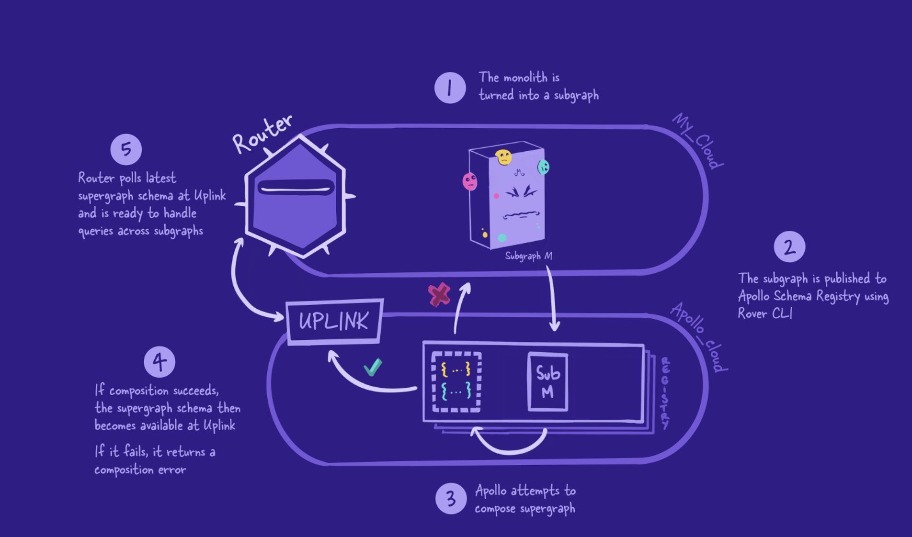

##### Migration Plan

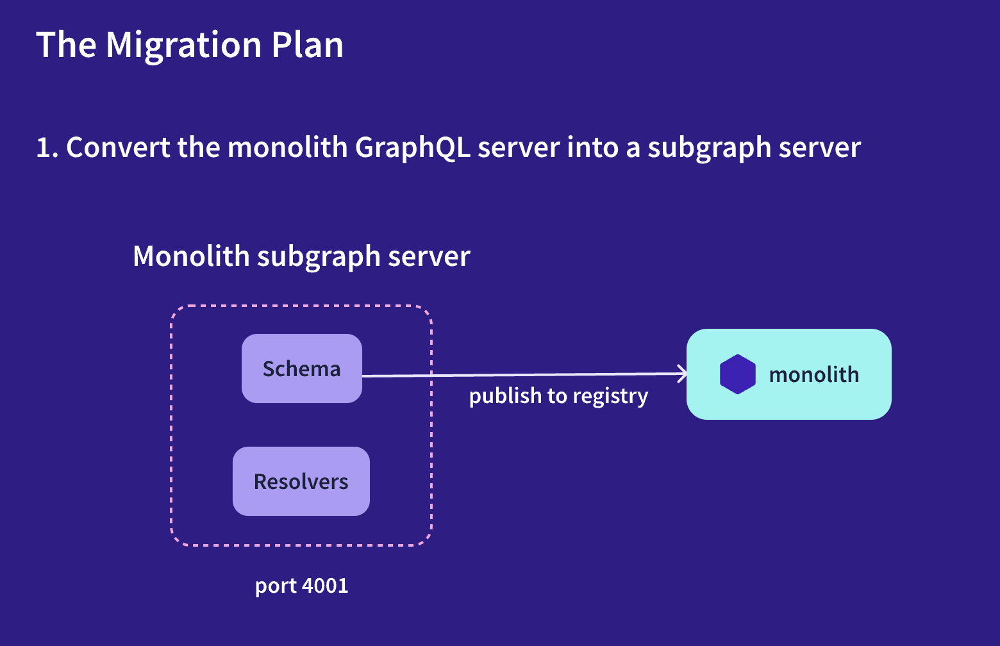
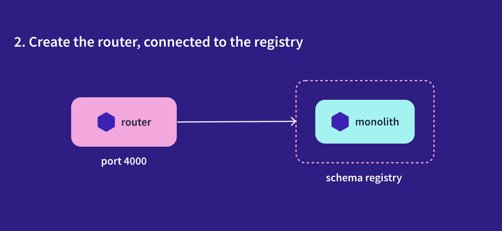
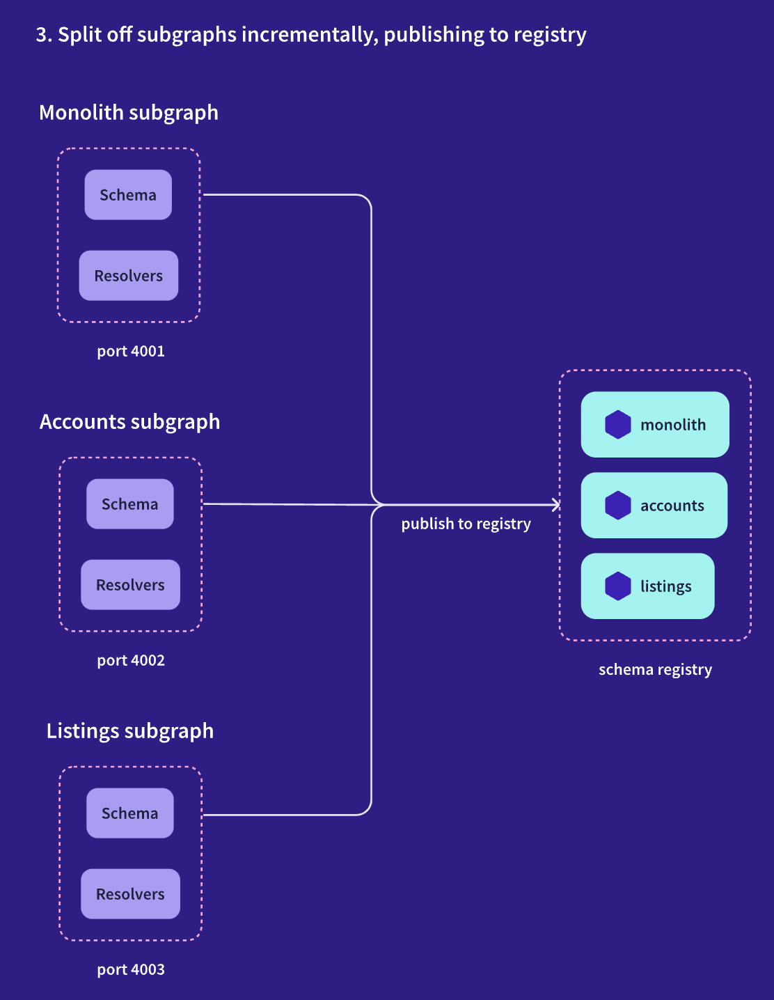

## Getting Started

`GIVEN` the GraphQL Monolith project exists,
`THEN` create graph in Apollo Studio (**monolith architecture**)

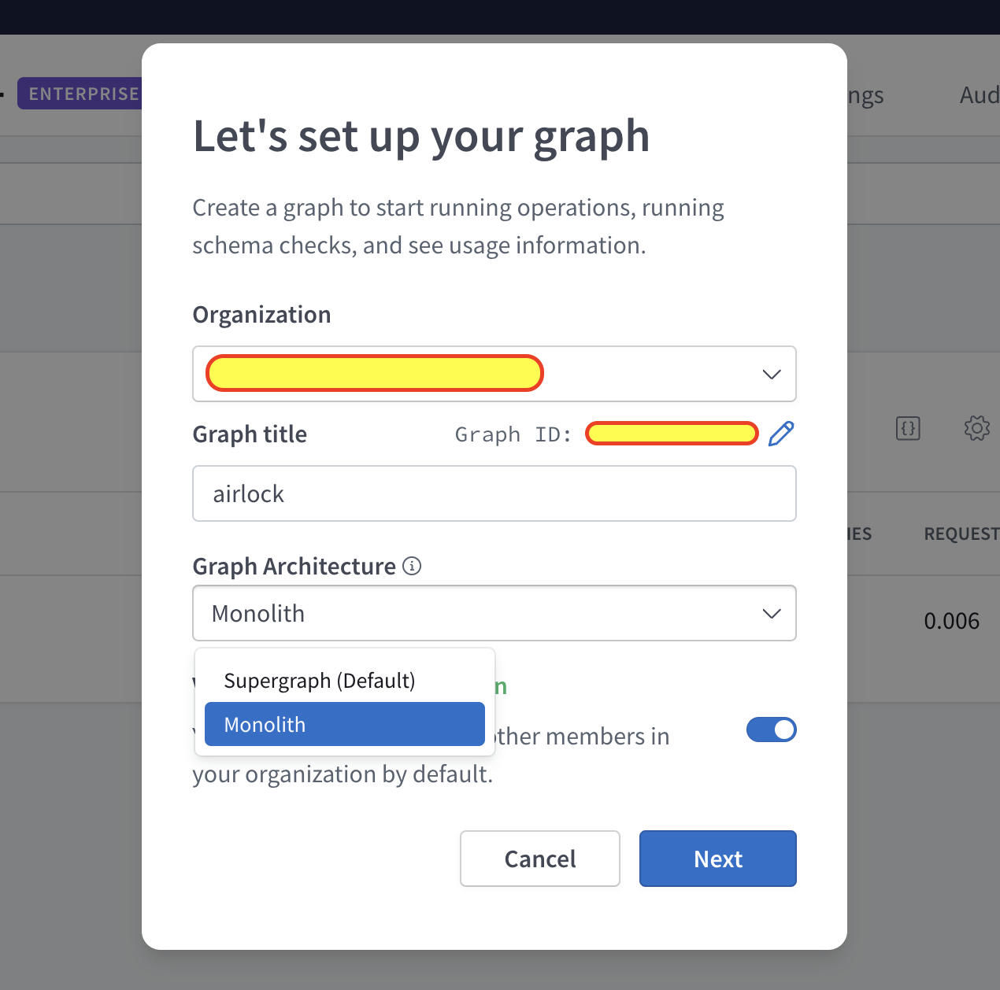
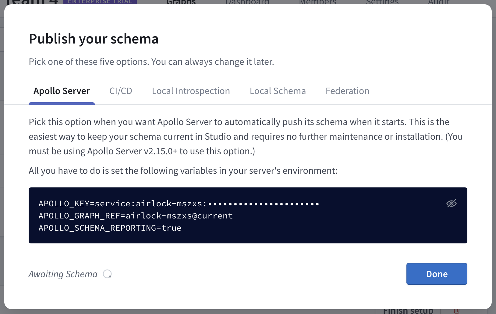

### Create Environment Variables

`monolith/.env`

```env
APOLLO_KEY=your-graphs-apollo-key
APOLLO_GRAPH_REF=your-graph-name@current
```

With our environment variables saved, we're ready to share our schema with Apollo Studio. Click the _Local Schema_ button in the modal. This opens up a text area where we can paste in our existing `monolith` schema.

Navigate to the `schema.graphql` file inside of the monolith directory, and copy the entire schema. Back in Studio, paste the copied schema into the text area.

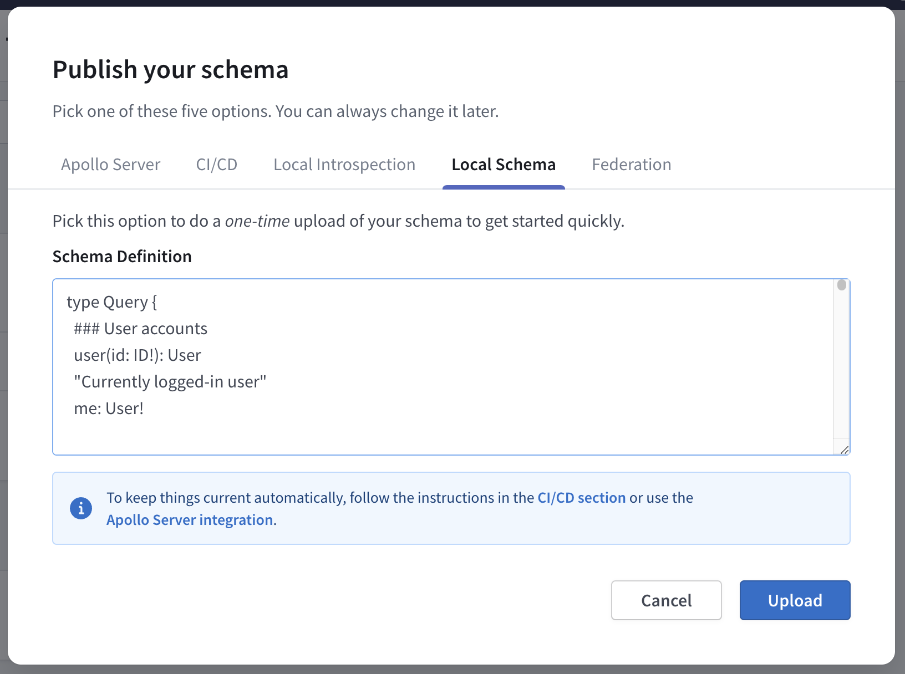

Click _Upload_ to submit your schema. When the page refreshes, we should see an overview of all of our types on the Schema Reference page. To test things out, head over to Explorer and run the previous query again!

> Note: The first time you try to run the query, Explorer will prompt you for the URL of your production server! We'll set the Endpoint value to http://localhost:4000.

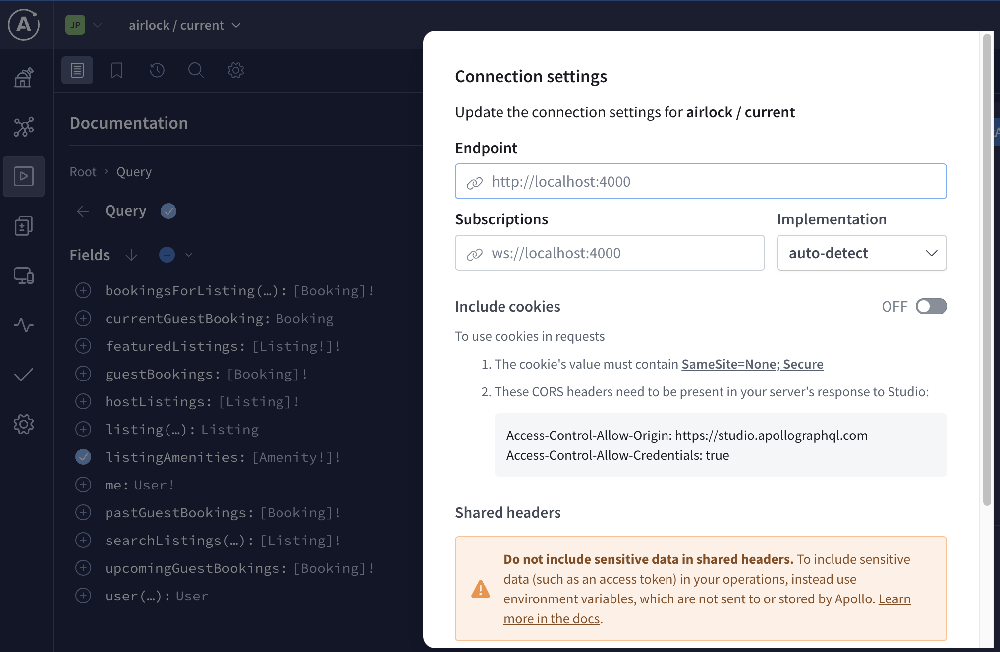

### Install Rover CLI

#### MacOS / Unix-like

```bash
curl -sSL https://rover.apollo.dev/nix/latest | sh
```

#### Windows

```bash
iwr 'https://rover.apollo.dev/win/latest' | iex
```

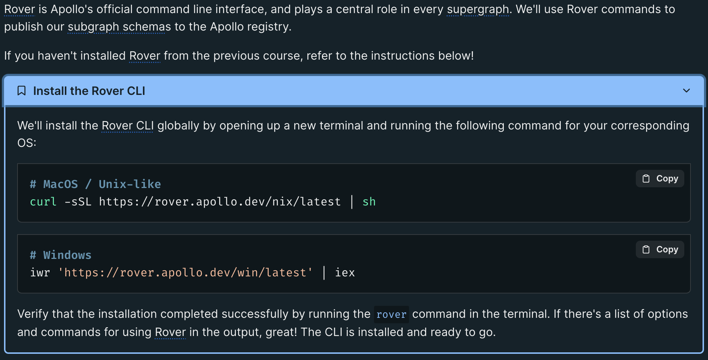

### Authenticate Rover

Copy your `APOLLO_KEY` and run the command below

```bash
rover config auth
```

```bash
lightzane@JPs-MacBook-Air odyssey-voyage-II-server % rover config auth
Go to https://studio.apollographql.com/user-settings/api-keys and create a new Personal API Key.
Copy the key and paste it into the prompt below.
>
Successfully saved API key.
lightzane@JPs-MacBook-Air odyssey-voyage-II-server %
```

## Optionally run the Client

https://github.com/lightzane/odyssey-voyage-II-client

## Install Apollo Subgraph

Converting monolith to subgraph

```bash
npm install @apollo/subgraph
```

`buildSubgraphSchema` with `typeDefs` and `resolvers` in `index.js`

and update `schema.graphql` to include the following:

```graphql
extend schema
  @link(url: "https://specs.apollo.dev/federation/v2.5", import: ["@key"])
```

> We'll want to make sure to opt in to the latest Federation 2 features for this subgraph

## Publish Subgraph

The same command we used to publish subgraph will have an error since the graph we created is having `Monolith` architecture instead of `Federation`

```bash
rover subgraph publish <APOLLO_GRAPH_REF> \
  --schema <SCHEMA_FILE_PATH> \
  --name <SUBGRAPH_NAME> \
  --routing-url <SERVER_URL>
```

```text
error[E007]: The graph `[APOLLO_GRAPH_REF]` is a non-federated graph.
This operation is only possible for federated graphs.
```

Well, when we set up our graph in Studio, we chose a monolith architecture, which created a non-federated graph. This was suitable for our purposes at the time, but now that we're breaking down the monolith into subgraphs, we need to make sure our graph is using federation.

We can convert it into a supergraph using the same command as before: `rover subgraph publish`, and the addition of the `--convert` flag.

Let's try that command again, this time including the `--convert` flag.

```bash
rover subgraph publish <APOLLO_GRAPH_REF> \
  --schema ./monolith/schema.graphql \
  --name monolith \
  --routing-url http://localhost:4001 \
  --convert
```

## Authentication and Authorization

How auth works in this project -> Airlock

Airlock has two types of users: _hosts_ and _guests_. Each type of user can perform different kinds of actions.

When logged in as a host, you can:

- create listings
- manage bookings for your listings
- write reviews about guests

When logged in as a guest, you can:

- book places to stay
- write reviews about the location and the host
- manage your space credits

Currently, guest users are not allowed to create listings, and host users are not allowed to book places to stay.

With these business rules, our Airlock GraphQL API needs to control which users can see and interact with certain fields in the graph. This is where authentication and authorization come in.

- `Authentication` is determining whether a given user is logged in, and subsequently determining which user someone is. (They are who they say they are.)

- `Authorization` is determining what a given user has permission to do or see. (They're allowed to do what they're trying to do.)

> Note: First time working with auth? Check out the [Authentication & Authorization side quest](https://www.apollographql.com/tutorials/side-quest-auth/) for a closer look at how to verify user logins and permissions in a single GraphQL server.

```
Authorization: Bearer user-1
```

## Install Router

`./router` directory

```bash
curl -sSL https://router.apollo.dev/download/nix/latest | sh
```

Other options to download router - https://www.apollographql.com/docs/router/quickstart/#download-options

### Router config file

`./router/config.yaml` (auto-generated)

```yaml
include_subgraph_errors:
  all: true # Propagate errors from all subgraphs
```

By default, subgraph errors are omitted from router logs for security reasons. The setting we're referencing in the configuration file, `include_subgraph_errors`, is a setting that will allow the router to share the details of any errors that occur as it communicates with subgraphs. By setting the `all` key to `true`, we're telling the router that we want to know about errors that occur in all of our subgraphs.

This is great for development purposes, because it will help us troubleshoot anything that goes wrong along the way!

### Adding Authorization

```diff
+headers:
+  all:
+    request:
+      - propagate:
+          named: 'Authorization'
 include_subgraph_errors:
   all: true # Propagate errors from all subgraphs
```

Let's break down what these new lines do.

- The `headers` key is where we set all of our rules for HTTP headers.

- `all` indicates that the rules nested underneath will apply to all the subgraphs. We could specify which ones using the `subgraphs` key, but we know that for Airlock we'll need to pass it to all of them.

- `request` specifies that the included headers should apply to requests the router receives.

- Finally, we want to pass the `Authorization` header to all the subgraphs, so we'll use the `propagate` key, then indicate the name of the header with `named: 'Authorization'`.

## Setting up the subgraph for auth

The good news is that the monolith subgraph is already set up for auth!

`./monolith/index.js`

```js
context: async ({ req }) => {
  const token = req.headers.authorization || '';
  const userId = token.split(' ')[1]; // get the user name after 'Bearer '

  let userInfo = {};
  if (userId) {
    const { data } = await axios.get(`http://localhost:4011/login/${userId}`).catch((error) => {
      throw AuthenticationError();
    });

    userInfo = { userId: data.id, userRole: data.role };
  }

  const { cache } = server;

  return {
    ...userInfo,
    dataSources: {
      ...
    },
  };
},
```

## Running Router with Config

```bash
APOLLO_KEY=<APOLLO_KEY> APOLLO_GRAPH_REF=<APOLLO_GRAPH_REF> ./router --config config.yaml
```

## Update Connection String in Apollo Studio

`Explorer > Settings > Connection String`

Update from `localhost:4000` to `http://127.0.0.1:4000/`

### 👩🏽‍🔬 Testing the Authorization headers

Let's give it a try! We can head back over to the Explorer in Apollo Studio to test out a query for the router.

We'll try out a query that requires an authenticated and authorized user: retrieving a host's listings. This query needs you to be logged in as a host.

Using Explorer, let's build a query to retrieve a host's listings. For each listing, we'll ask for the `title`, `costPerNight`, `description`, `photoThumbnail`, `numOfBeds`, and `locationType`.

```graphql
query GetHostListings {
  hostListings {
    title
    costPerNight
    description
    photoThumbnail
    numOfBeds
    locationType
  }
}
```

Let's run the query, and… uh oh! We get back an `AuthenticationError` with no logged-in user 😱

#### Add Authorization Headers

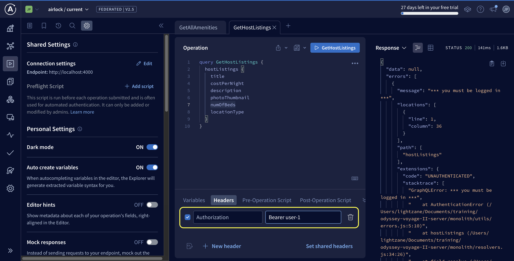

#### User 1 Result

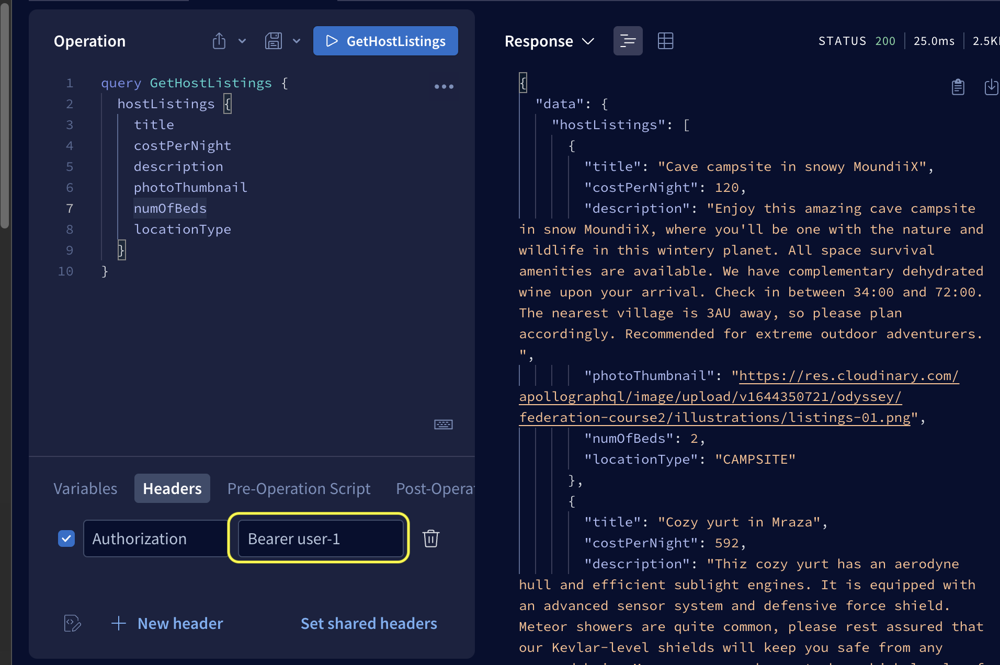

#### User 2 Result

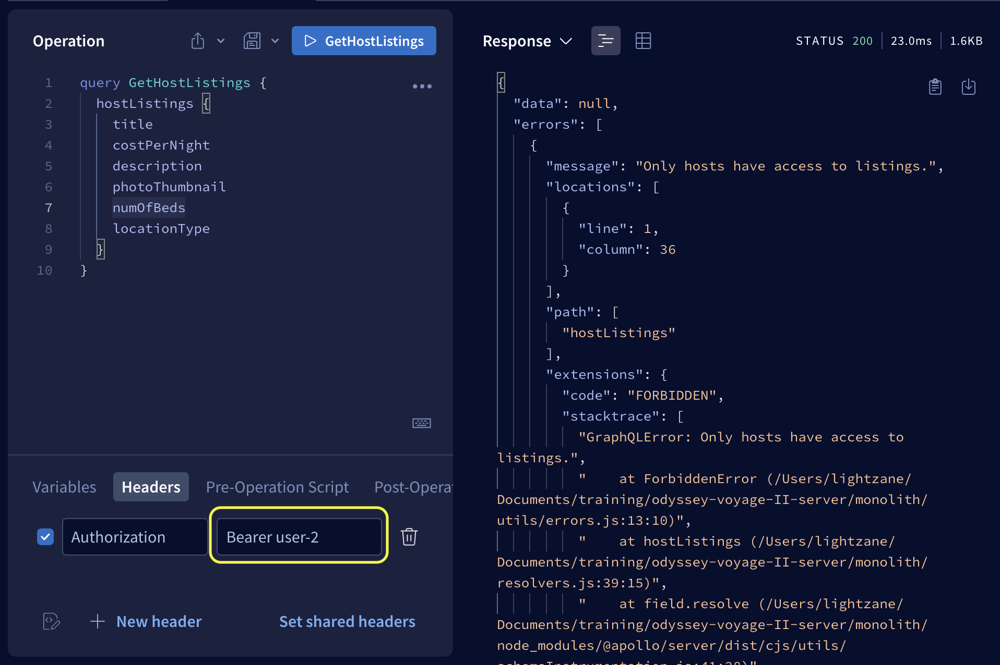

## Setup each Subgraph (Accounts, etc)

Use may use the `subgraph-template`

`subgraph-accounts/index.js`

```js
const port = 4002;
const subgraphName = 'accounts';
```

`subgraph-accounts/schema.graphql`

```graphql
"Represents an Airlock user's common properties"
interface User {
  id: ID!
  "The user's first and last name"
  name: String!
  "The user's profile photo URL"
  profilePicture: String!
}
```

What about in the `monolith` subgraph? Well, we still need to keep the `User` interface defined there. We reference it as a return type for the `Review.author` field, and we also implement the interface for the `Host` and `Guest` types.

However, we don't need to keep all the extra fields that are the responsibility of the `accounts` subgraph! We can remove both `name` and `profilePicture`.

`monolith/schema.graphql`

```diff
"Represents an Airlock user's common properties"
interface User {
  id: ID!
- "The user's first and last name"
- name: String!
- "The user's profile photo URL"
- profilePicture: String!
}
```

We do still need to keep the `id` field, because that's the bare minimum we need to identify a specific instance of a user. Like a stub,

### Creating entities for Host and Guest

`subgraph-accounts/schema.graphql`

```graphql
type Host implements User @key(fields: "id") {
  id: ID!
  "The user's first and last name"
  name: String!
  "The user's profile photo URL"
  profilePicture: String!
  "The host's profile bio description, will be shown in the listing"
  profileDescription: String!
}

"A guest is a type of Airlock user. They book places to stay."
type Guest implements User @key(fields: "id") {
  id: ID!
  "The user's first and last name"
  name: String!
  "The user's profile photo URL"
  profilePicture: String!
}
```

`monolith/schema.graphql`

```diff
"A host is a type of Airlock user. They own listings."
type Host implements User @key(fields: "id") {
  id: ID!
- "The user's first and last name"
- name: String!
- "The user's profile photo URL"
- profilePicture: String!
- "The host's profile bio description, will be shown in the listing"
- profileDescription: String!
  "The overall calculated rating for the host"
  overallRating: Float
}

"A guest is a type of Airlock user. They book places to stay."
type Guest implements User @key(fields: "id") {
  id: ID!
- "The user's first and last name"
- name: String!
- "The user's profile photo URL"
- profilePicture: String!
  "Amount of money in the guest's wallet"
  funds: Float!
}
```

## Publish schema changes

```bash
rover subgraph publish <APOLLO_GRAPH_REF> \
    --name accounts \
    --schema ./subgraph-accounts/schema.graphql \
    --routing-url http://localhost:4002
```

Wait - what are these errors in the terminal? Here's an example of one of the errors we see after running the command.

```bash
INVALID_FIELD_SHARING: Non-shareable field "Host.name" is resolved from multiple subgraphs:
it is resolved from subgraphs "accounts" and "monolith" and defined as non-shareable in all of them
```

## Invalid Field Sharing

Let's talk about what this error means, and what we can do to fix it!

We published our `accounts` schema to Studio, which triggered composition. But right now, the latest version of the `monolith` subgraph that Studio is aware of is the one without our most recent changes. As far as it knows, the `monolith` subgraph still includes these accounts-related fields on `Host` and `Guest`!

As a result, the composition process discovered a number of fields that are defined in both of the subgraphs Studio knows about. This causes an error because by default, a field can't be defined or resolved by more than one subgraph.

If we did want a field to be defined or resolved by multiple subgraphs, we'd need to enable this explicitly by using the `@shareable` directive.

### The @shareable directive

The `@shareable` directive enables multiple subgraphs to resolve a particular object field (or set of object fields).

For example, if we wanted to allow both the `monolith` and `accounts` subgraphs to resolve the `Host.name` field, we could leave the definitions in both and mark the field with `@shareable`.

```graphql
type Host implements User @key(fields: "id") {
  # ... other Host fields
  name: String @shareable
}
```

> Note: You'd also need to add the `@shareable` directive to the Federation 2 schema definition imports in the subgraph, as [detailed in the docs](https://www.apollographql.com/docs/apollo-server/using-federation/apollo-subgraph-setup/#2-opt-in-to-federation-2).

However, in our case, we don't want to do this!

For Airlock, we've decided that only the accounts subgraph will be responsible for these fields. Fortunately, we can fix this error by publishing our changes to the monolith subgraph. This will bring Studio up to date on our decision to relocate accounts-related fields to the accounts subgraph.

## Publishing the `monolith` subgraph

Let's take care of this step now, and clear up those errors in the terminal! Run the following `rover subgraph publish` command for the `monolith` subgraph, swapping in the values specific to your graph.

```bash
rover subgraph publish <APOLLO_GRAPH_REF> \
--schema ./monolith/schema.graphql \
--name monolith
```

Then we can now safely publish `accounts` subgraph without encoutering those errors

## Add Resolvers

`subgraph-accounts/resolvers.js`

```js
const resolvers = {
  Host: {
    __resolveReference: (user, { dataSources }) => {
      return dataSources.accountsAPI.getUser(user.id);
    },
  },
  Guest: {
    __resolveReference: (user, { dataSources }) => {
      return dataSources.accountsAPI.getUser(user.id);
    },
  },
};
```

`monolith/resolvers.js`

```diff
const resolvers = {
  Listing: {
-   host: ({ hostId }, _, { dataSources }) => {
-     return dataSources.accountsAPI.getUser(hostId);
-   },
+   host: ({ hostId }) => {
+     return { id: hostId };
+   },
-   bookings: ({ id }, _, { dataSources }) => {
-     return dataSources.bookingsDb.getBookingsForListing(id);
-   },
+   guest: ({ guestId }) => {
+       return { id: guestId };
+   },
  },
  Review: {
-   author: ({ authorId }, _, { dataSources }) => {
-     return dataSources.accountsAPI.getUser(authorId);
-   },
+   author: (review) => {
+       let role = '';
+       if (review.targetType === 'LISTING' || review.targetType === 'HOST') {
+           role = 'Guest';
+       } else {
+           role = 'Host';
+       }
+       return { __typename: role, id: review.authorId };
+   },
  },
};
```

## Resolving the Interface

We need a `resolveType` resolver for the `User` interface! We actually already have one defined in the `monolith` subgraph, so all we need to do is move that function over to the `accounts` subgraph. This resolver should only belong in the `accounts` resolvers, so delete it from the `monolith` resolvers.

`subgraph-accounts/resolvers.js`

```js
const resolvers = {
  User: {
    __resolveType(user) {
      return user.role;
    },
  },
};
```

> Note: Make sure you delete the `__resolveType` function from the `monolith` resolvers.

`monolith/resolvers.js`

```diff
- User: {
-  __resolveType(user) {
-    return user.role;
-  }
- },
```

## Creating data sources

```diff
+ const { cache } = server;

 return {
   ...userInfo,
   dataSources: {
+    accountsAPI: new AccountsAPI({ cache }),
   },
};
```

## Testing our changes

```graphql
query GetListing {
  listing(id: "listing-1") {
    host {
      name
      profilePicture
      profileDescription
    }
    reviews {
      rating
      author {
        id
        name
      }
    }
  }
}
```

One more thing

```graphql
query GetMyProfile {
  me {
    id
    name
    profilePicture
  }
}
```

When you run the query... uh-oh! We still get an error, but it's a new one: `Abstract type "User" must resolve to an Object type at runtime for field "Query.me".`

Hmm, you might be thinking: "Didn't we implement a `__resolveType` resolver to take care of this?"

Well, we did, but that resolver belonged to the `accounts` subgraph. And right now, the `me` field in our `GetMyProfile` query above still belongs to the `monolith` subgraph! The router is asking the `monolith` subgraph to resolve the field, when really it should be asking the `accounts` subgraph.

We'll fix this by adding the following in `subgraph-accounts/schema.graphql`:

```graphql
type Query {
  user(id: ID!): User
  "Currently logged-in user"
  me: User!
}
```

And removing it from the `monolith/schema.graphql`

```diff
type Query {
- user(id: ID!): User
- "Currently logged-in user"
- me: User!
}
```

### Move mutations and update resolvers
